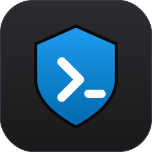
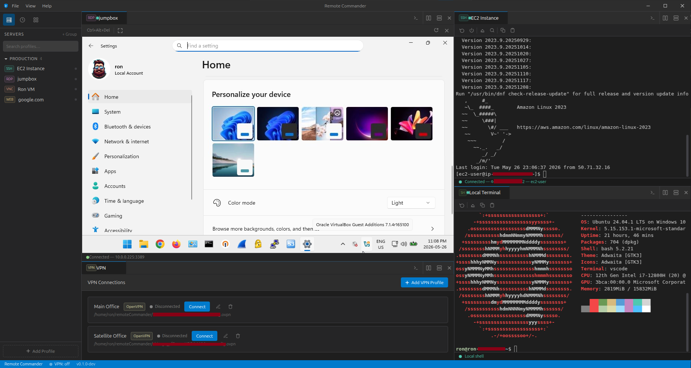
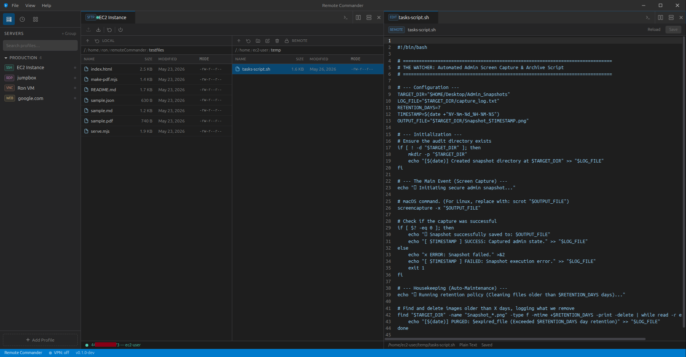

<div align="center">



# Remote Commander

**One window for every remote connection — SSH, SFTP, RDP, VNC, VPN, and a web console.**

A cross-platform desktop app that brings terminals, file transfer, remote desktops, an
embedded web console, a remote file editor, and VPN control into a single tabbed,
split-pane, VS Code–styled workspace.

Electron · React 19 · TypeScript · Tailwind v4

</div>

---

## Overview

Remote Commander is a unified remote-access manager for engineers and homelabbers who are
tired of juggling PuTTY, an SFTP client, an RDP window, a VNC viewer, and a VPN tray icon.
It keeps your servers as **profiles** (grouped, tagged, searchable), opens each connection
as a **tab** you can **split** side-by-side, encrypts your credentials **at rest**, and can
**auto-connect the right VPN** before a session.

Built-in clients are pure JavaScript where possible (SSH, SFTP, VNC); RDP and VPN integrate
with battle-tested system tools (guacd/FreeRDP, OpenVPN/WireGuard).

> **Platforms:** Windows, macOS, and Linux. **Status:** active development (`v0.1.0`).

---

## ✨ Features

### Connect to anything
- **SSH terminal** — full xterm.js terminal with 256-color, search, web-links, copy/paste
  (Ctrl+Shift+C/V), **jump-host / bastion** support, and **automatic reconnect** with backoff.
- **SFTP** — dual-pane (local ↔ remote) file manager with drag-and-drop transfers, a live
  **transfer queue** (speed/ETA, cancel), breadcrumbs, rename/mkdir/delete, and a visual
  **chmod permission editor**. Reuses an existing SSH connection when one is open.
- **RDP — in the tab** — remote desktops render **inside the app** via Guacamole (`guacd`),
  with mouse/keyboard, Ctrl+Alt+Del, and fit-to-window scaling. Falls back to an external
  **FreeRDP** window automatically when `guacd` isn't available.
- **VNC** — in-app remote desktop via noVNC over a built-in local WebSocket↔TCP proxy
  (no separate websockify needed), with password prompt and viewport scaling.
- **Web console** — open device/cloud management UIs (firewalls, switches, NAS,
  ESXi/Proxmox, iDRAC/iLO/BMC, cloud consoles) in a tab via a **sandboxed** embedded
  browser, with back/forward/reload, an address bar, per-profile isolated sessions, and a
  browser-style **"your connection is not private" prompt** on self-signed/invalid certs
  (proceed to trust that origin for the session, or opt a profile in permanently). No second
  browser engine —
  reuses Electron's Chromium. Includes a **document viewer** (inline PDF; formatted
  JSON/Markdown in a script-disabled sandbox), **per-profile proxy** (SOCKS/HTTP, e.g.
  an SSH tunnel to a bastion), and **bookmarks**.
- **Remote file editor** — double-click a file in the SFTP pane (remote *or* local) to
  edit it with **CodeMirror** syntax highlighting and save straight back over SFTP. Dirty
  indicator, Ctrl+S, unsaved-close guard; 5 MB / text-only safety limits.
- **Local terminal** — a real local shell tab (PTY) right next to your remote sessions.

### Manage everything
- **Profiles & groups** — organize servers into collapsible groups, tag them, and search by
  name/host/protocol/tag. Per-protocol settings (RDP resolution/color depth/domain/cert
  mode, VNC display/port/encoding).
- **VPN integration** — manage **OpenVPN** and **WireGuard** profiles, connect/stop from the
  app (with saved username **and** password), see the assigned IP, and **auto-connect** a
  profile's VPN before opening the session (or get prompted if it's down).
- **Split panes & tabs** — VS Code–style tab strip with drag-reorder, pinning, and inline
  rename. **tmux-style splitting:** split any pane right or down, **nest splits arbitrarily**,
  **drag a tab onto any pane** to move it there, and resize each divider independently. The
  `+` button opens a local terminal.
- **Workspaces** — save your current set of tabs + layout and restore it later; mark one as
  **default** to reopen on startup.
- **Connection history** — every connect/disconnect logged to a local SQLite database, with
  filtering by protocol/host/server/date and **CSV export**.
- **Encrypted import/export** — back up or move profiles as a password-protected
  (AES-256-GCM) `.rcprofiles` file, credentials included.

### Built to feel native
- Frameless, dark, VS Code Dark Modern theme throughout (including scrollbars and a custom
  title bar with File/View/Help menus).
- **Universal copy/paste** — standard `Ctrl/Cmd+C/V` for inputs and selected text, **right-click
  Cut/Copy/Paste/Select-All anywhere** (including inside the web-console `<webview>` guests), and
  terminal-native `Ctrl+Shift+C/V` (plus right-click) in the SSH and local-terminal tabs.
- Credentials persist **encrypted at rest** (OS keychain via keytar, or an encrypted file
  fallback) so you don't re-type them every launch.

---

## 📸 Screenshots





---

## ⬇️ Install (end users)

Grab the latest installer for your OS from the
**[Releases page](https://github.com/RonBulaon/remoteCommander/releases/latest)**, then follow the
matching one-page guide — each is end-to-end (download → install → run, plus optional RDP/VPN setup):

- 🪟 **[Windows](docs/install-windows.md)** — `.exe` installer
- 🍎 **[macOS](docs/install-macos.md)** — `.dmg`
- 🐧 **[Linux](docs/install-linux.md)** — AppImage or `.deb`

---

## 🚀 Quick start (development)

> ⚠️ The Electron app lives in the **nested** `remoteCommander/` subfolder. Run npm there.
> Full instructions (Node version, native modules, download sources) are in
> **[BUILD.md](BUILD.md)**.

```bash
git clone https://github.com/RonBulaon/remoteCommander.git
cd remoteCommander/remoteCommander      # into the nested app folder
npm install
npm run dev                              # launch with hot reload
```

Useful scripts (run inside `remoteCommander/remoteCommander`):

```bash
npm run typecheck     # tsc on main + renderer (primary CI signal)
npm run build         # type-check + bundle to out/
npm run build:win     # → NSIS installer   (run on Windows)
npm run build:mac     # → .dmg             (run on macOS)
npm run build:linux   # → AppImage + .deb  (run on Linux)
```

**Producing installers, two ways:** run the matching `build:*` script **on each OS**, **or**
push a version tag and let the **GitHub Actions** workflow build all three on hosted
Windows/macOS/Linux runners (so you get the macOS `.dmg` without owning a Mac) and attach them
to a GitHub Release. Both paths — and dependency install per OS — are documented step-by-step in
**[BUILD.md → Part 3](BUILD.md)**. Downloads use the **official GitHub** Electron sources (no
registry mirror configured).

To judge real performance, run the **production** build rather than the dev server —
`npm run dev` is unminified with React in development mode, so it feels slower:

```bash
npm run build && RC_ENABLE_GPU=1 npm start   # minified prod build, GPU-accelerated
```


---

## 🧩 Runtime requirements

The app bundles its SSH/SFTP/VNC clients. **RDP and VPN shell out to system tools** that
must be installed on the machine *running* the app — without them those features show a
clear message (and RDP offers the external-window fallback). The **local terminal** needs an
optional native module.

| Feature | Needs | Install (Linux example) |
|---|---|---|
| SSH / SFTP / VNC | nothing extra | — |
| Local terminal | `node-pty` (optional native build) | `sudo apt install build-essential` then `npm install node-pty` |
| RDP (in-tab) | `guacd` reachable at `127.0.0.1:4822` | `sudo apt install guacd` _(or `docker run -d -p 4822:4822 guacamole/guacd`)_ |
| RDP (fallback) | FreeRDP CLI | `sudo apt install freerdp2-x11` |
| VPN — OpenVPN | `openvpn` + passwordless `sudo` | `sudo apt install openvpn` |
| VPN — WireGuard | `wg-quick` + passwordless `sudo` | `sudo apt install wireguard-tools` |

**Per-platform install + setup guides** (download → run, with copy-paste commands):
**[Windows](docs/install-windows.md)** · **[macOS](docs/install-macos.md)** ·
**[Linux](docs/install-linux.md)**. See also **[BUILD.md → Part 2](BUILD.md)**.

---

## 🔐 Security at a glance

- **Renderer is sandboxed from Node**: context isolation is on, and the preload bridge
  **allow-lists every IPC channel**.
- **Credentials encrypted at rest** via the OS keychain (keytar), or an Electron
  `safeStorage`-encrypted file when no keychain exists. VPN passwords are encrypted in the
  profile and **never sent to the UI**.
- **Local-only proxies**: the VNC and RDP WebSocket bridges bind to `127.0.0.1`.
- **Sandboxed web consoles**: every web-console `<webview>` runs with no Node access, its
  own isolated session partition, and forced `webSecurity`; popups go to the system browser.
  TLS validation stays on; an invalid cert shows a **"proceed anyway"** prompt that trusts
  that origin for the session only (or opt a profile in permanently) — never a global bypass.
- **No shell injection** for VPN; credentials are passed via a `0600` temp file, and
  elevation uses non-interactive `sudo -n` (the app never runs as root).
- **Never commit secrets** — `.gitignore` blocks `*.pem`/`*.ovpn`/`*.key`/`*.p12`/`*.pfx`.

> **Convenience note:** by design, credentials persist on disk so they survive restarts. On
> systems without an OS keychain (e.g. WSL2), the fallback may be base64-encoded rather than
> strongly encrypted. Use full-disk encryption on such machines.

---

## 🏗️ Tech stack & architecture

| Layer | Tech |
|---|---|
| Shell | Electron 39 · electron-vite 5 · electron-builder 26 |
| UI | React 19 · TypeScript 5.9 · Tailwind CSS v4 · Radix UI |
| State | Zustand 5 |
| Terminals | xterm.js 5 |
| Protocols | `ssh2`, `ssh2-sftp-client`, `@novnc/novnc`, `guacamole-lite` + `guacamole-common-js`, `node-pty` |
| Secrets / data | `keytar`, Electron `safeStorage`, `better-sqlite3` |

Three Electron contexts: a **React renderer** → a typed `lib/ipc.ts` wrapper → an
allow-listing **preload bridge** → a **Node main process** where per-protocol services hold
the live sessions. The full picture — every service, the complete IPC contract, the data/
security model, and recipes for adding a protocol or tab — is documented in
**[ARCHITECTURE.md](ARCHITECTURE.md)**.

```
remoteCommander/            ← repo root (docs)
└── remoteCommander/        ← the Electron app
    └── src/{main,preload,renderer}
```

---

## 📚 Documentation

| Doc | What's in it |
|---|---|
| **[User Guide](docs/user-guide.md)** | How to use the features — profiles, connecting, splitting panes, workspaces, VPN, clipboard, shortcuts, troubleshooting. |
| **[ARCHITECTURE.md](ARCHITECTURE.md)** | Exhaustive code reference — process model, IPC contract, every service/store/component, security, conventions, extension recipes. |
| **[BUILD.md](BUILD.md)** | Rebuild the dev environment on a new machine, runtime tool requirements, and how to produce Windows/macOS/Linux installers — locally per-OS or via the GitHub Actions release workflow. |
| **Install guides** | End-user download → install → run, per platform — **[Windows](docs/install-windows.md)** · **[macOS](docs/install-macos.md)** · **[Linux](docs/install-linux.md)**. |
| **[CHANGELOG.md](CHANGELOG.md)** | What changed in each release (Keep a Changelog format). |

---

## 🗺️ Status & roadmap

- ✅ SSH, SFTP, VNC, in-tab RDP (+ FreeRDP fallback), local terminal
- ✅ Web console tabs (sandboxed embedded browser) with document viewer (PDF/JSON/Markdown),
  per-profile proxy, and bookmarks
- ✅ Remote/local file editor (CodeMirror) — edit over SFTP and save in place
- ✅ OpenVPN / WireGuard management with auto-connect-before-session
- ✅ Profiles/groups, workspaces, encrypted import/export, connection-history audit + CSV
- ⏳ Auto-update (dependency present; `publish` URL is a placeholder — not yet wired)
- ⏳ Cloud profile sync (descoped for now)

---

## License

Released under the **MIT License** — see [LICENSE](LICENSE). © 2026 Ron Bulaon.

You're free to use, modify, and redistribute Remote Commander, including commercially.
The only condition is that the copyright notice and license text stay with every copy or
substantial portion — so the original authorship travels with every fork.

> **Created by Ron Bulaon.** Built on top of the open-source ecosystem (Electron, React,
> xterm.js, ssh2, noVNC, Guacamole, and others), each under its own license.

> **AI-assisted development.** Parts of Remote Commander were built with AI assistance; every
> AI-generated suggestion was reviewed, tested, and adapted by the maintainer before it shipped.
